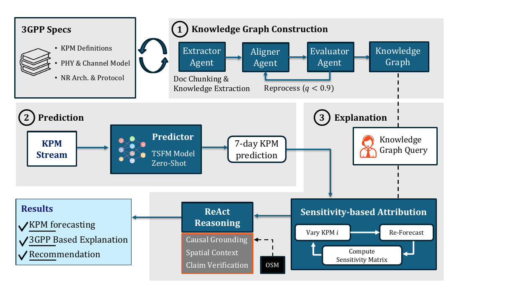
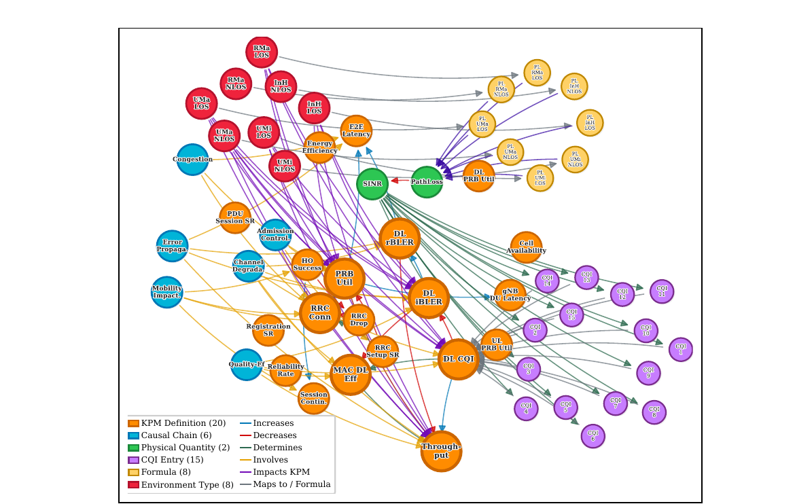

# TelcoAgent: A Scalable 5G Multi-KPM Forecasting with 3GPP-Grounded Explainability

[](https://www.python.org/downloads/release/python-3100/)
[](LICENSE)
[](paper/TelcoAgent_Globecom.pdf)

Official implementation of **TelcoAgent**, a foundation-model-based framework
for accurate, scalable, and explainable forecasting of multiple Key
Performance Measurements (KPMs) across diverse 5G network cells — **without
site-specific training**. A single zero-shot TSFM forward pass produces a
7-day forecast for 7 KPMs (3GPP TS 28.554), and a separate ReAct agent
grounded in an automatically constructed 3GPP knowledge graph explains
anomalies and recommends actions.

<p align="center">
  
  <br>
  <em>The TelcoAgent architecture: ① knowledge graph construction,
  ② TSFM-based zero-shot forecasting, ③ reasoning and explanation.</em>
</p>

## Overview

TelcoAgent comprises three pipelines, mirrored 1:1 by the package layout
(see [`docs/module_map.md`](docs/module_map.md) for the full module map):

| Paper | Package | What it does |
|---|---|---|
| ① Knowledge Graph Construction | [`telcoagent/kg_construction/`](telcoagent/kg_construction/) | Three LLM agents (Extractor → Aligner → Evaluator, with a *q* < 0.9 reprocess loop) build a 3GPP knowledge graph directly from specification PDFs |
| ② Prediction | [`telcoagent/prediction/`](telcoagent/prediction/) | A single Chronos-2 zero-shot forward pass over the multivariate KPM stream + a 3GPP-range physical clamp — no fine-tuning, no LLM on the forecast path |
| ③ Explanation | [`telcoagent/explainer/`](telcoagent/explainer/) | PAX-TS sensitivity attribution + a seven-tool ReAct agent that grounds every causal claim in the KG and OpenStreetMap context, with a deterministic numerical-fidelity audit |

## 3GPP Knowledge Graph

The explainer's domain knowledge comes exclusively from a knowledge graph
extracted from thirteen 3GPP specifications (TS 28.552/28.554,
TS 38.211–38.331, TR 38.901) — no telecom heuristics live in source code.
The constructed graph ships in this repo as
[`data/enriched_kg.json`](data/enriched_kg.json), locked by a sha256
snapshot test.

<p align="center">
  
  <br>
  <em>The constructed 3GPP knowledge graph: KPM definitions, causal chains,
  and physical-layer constraints.</em>
</p>

## Installation

```bash
git clone https://github.com/NextG-Wireless-Lab-NC-State/TelcoAgent.git
cd TelcoAgent

# Main env — TelcoAgent runtime + Moirai / MOMENT / Toto baselines
conda env create -f envs/environment.yml
conda activate telcoagent

# Slim sibling env — Chronos-2 only (its pinned chronos-forecasting==2.0.0
# conflicts with the transformers version the other baselines need)
conda env create -f envs/environment-chronos2.yml
```

LLM provider keys (explainer only — prediction needs no API key) go in a
gitignored `.env` at the repo root:

```bash
OPENAI_API_KEY=sk-...
```

## Quick Start

```bash
# Predict + explain a single station (TSFM forecast → anomaly events →
# KG-grounded ReAct report + RAGAS scoring)
PYTHONPATH=. python scripts/run_telcoagent_single.py \
    --station data/station/station_A_10.csv \
    --output output/telcoagent_single

# Rebuild the 3GPP knowledge graph from spec PDFs (offline, LLM-driven)
PYTHONPATH=. python scripts/run_kg_sweep.py
```

## Reproducing the Paper

[`paper/REPRODUCE.md`](paper/REPRODUCE.md) maps every figure and table to
the exact CLI command, conda env, and output directory — including the
7-baseline context-length sweep (~6–9 h on one RTX 4090):

```bash
bash scripts/baselines/_rerun_all_paper_baselines.sh
```

All forecasts — TelcoAgent and every baseline — pass through the identical
3GPP physical-range clamp
([`telcoagent/prediction/physical_clamp.py`](telcoagent/prediction/physical_clamp.py)),
and the 2-way zero-shot split (1944 h context / strictly held-out 168 h
target) has a single source of truth in
[`scripts/baselines/foundation_utils.py`](scripts/baselines/foundation_utils.py).

## Repository Structure

```
telcoagent/          Main package — mirrors the paper's three pipelines
  kg_construction/     ① Extractor / Aligner / Evaluator agents → enriched_kg.json
  prediction/          ② TSFM-only zero-shot predictor + physical clamp
  explainer/           ③ ReAct explainer, PAX-TS, 7 tools, fidelity audit
  agents/              Shared ReAct loop + tool registry
  ontology/ stores/ context/ llm/ evaluation/   Support modules
scripts/             Runtime entry points, baseline runners, plot generators
data/                enriched_kg.json (see Data Availability)
docs/module_map.md   Paper-figure ↔ module mapping
paper/               Paper PDF, reproduction guide, final figures
envs/                Conda env specs + foundation-model requirements
```

## Data Availability

- **Per-station KPM dataset**: collected from a commercial 5G network
  operating in the PCS band (Texas, USA). The raw measurements are **not
  redistributed** — operator details and data are covered by
  confidentiality agreements (see the paper).
- **3GPP specification PDFs**: not redistributed; download from
  [3gpp.org](https://www.3gpp.org/specifications) to rebuild the KG.
- **Knowledge graph** (`data/enriched_kg.json`): **included** — the
  spec-extracted KG the paper publishes.

## Citation

```bibtex
@inproceedings{telcoagent2026globecom,
  title     = {TelcoAgent: A Scalable 5G Multi-KPM Forecasting with
               3GPP-Grounded Explainability},
  author    = {Kim, Geon and Ron, Dara and Singh, Sukhdeep and Moogi, Suyog
               and Gajjar, Pranshav and Koduri, V V N K Someswara Rao
               and Hong, Een Kee and Shah, Vijay K.},
  booktitle = {IEEE Global Communications Conference (GLOBECOM)},
  year      = {2026}
}
```

## License

MIT — see [`LICENSE`](LICENSE).
